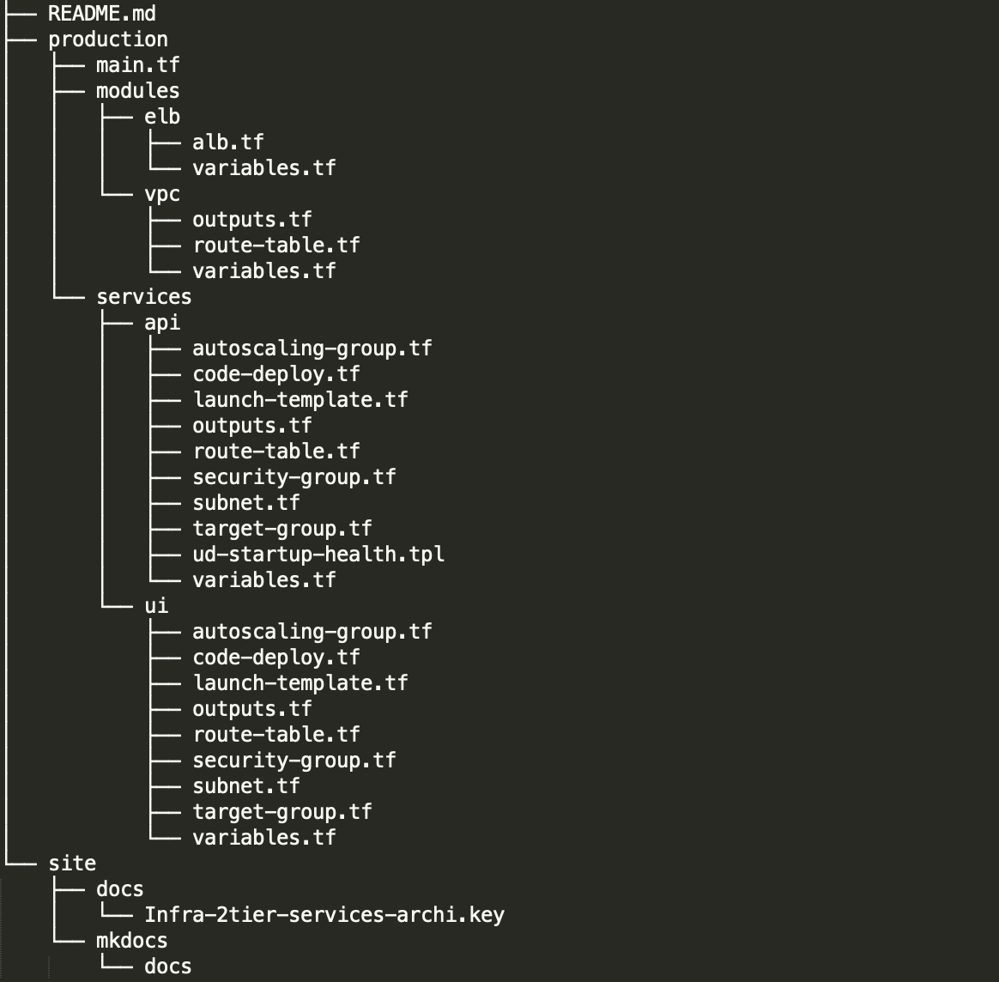

## infra-2tier-services Directory
---
infra-2tier-services의 디렉토리 구조입니다.

---

### 1. modules
>`elb`와 `vpc`가 구현되어 있습니다.  
>elb와 vpc는 기존 **infra-2tier-base에 기구축된 리소스를 참조**합니다.  
>
### 2. services
>`api`와 `ui`로 구성되어 있습니다.  
>각 서비스에서만 사용되는 리소스들로 이루어져 있습니다.  
>
### 3. site
#### 3.1 docs
>infra-2tier-services `명세 및 아키텍쳐`와 관련된 문서가 포함되어 있습니다.  
#### 3.2 mkdocs
>`매뉴얼 가이드` 폴더입니다.    
>mkdocs 마크다운 방식으로 글쓰기를 하며, `mkdocs serve`라는 명령어를 통해서 실시간으로 매뉴얼 내역을 확인할 수 있습니다. ([mkdocs.org](https://www.mkdocs.org) 참고)  