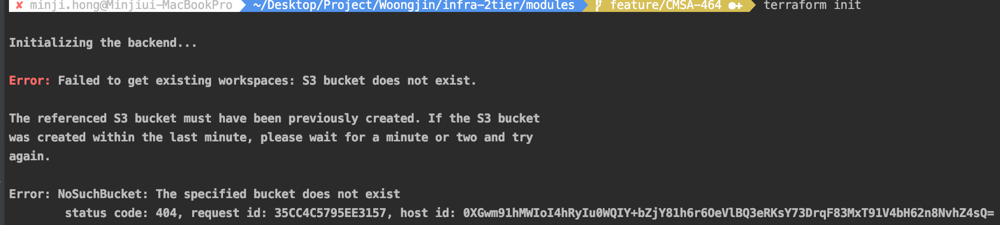

## infra-2tier-services 시작
---
**Infra 2tier Architecture - services**를 Terraform으로 구현한 프로젝트입니다.    
프로젝트 빌드 및 실행은 다음과 같은 순서로 이루어집니다.  
>
##### 1. IAM 계정 생성 및 AWS CLI 를 통한 로컬 환경 구성
###### 1.1 aws iam account 생성 (aws console)
>AWS 관리 콘솔에서 프로그래밍 방식 로그인 계정 생성 및 AdministratorRole 부여  
>
###### 1.2 awscli install  
```console
cmd $ brew install awscli
```  
###### 1.3 AWS local 환경 설정 
```console
cmd $ aws configure

    AWS Access Key ID [****************KCPQ]: 
    AWS Secret Access Key [****************OSRk]: 
    Default region name [ap-northeast-2]: 
    Default output format [None]: 
```
>
>
##### 2. terraform 설치 및 적용 
###### 2.1 terraform 설치
```console
cmd $ brew install terraform
```
>
###### 2.2 terraform 프로젝트 구성 (git clone)
```console
cmd $ cd ~
cmd $ mkdir workspace
cmd $ cd workspace

/* git clone */
cmd $ git clone https://github.com/pe-woongjin/infra-2tier-services.git
cmd $ cd ~/workspace/infra-2tier-services
```
>
###### 2.3 인프라 구축
```console
/* 개발 환경 기준 */
cmd $ cd ~/workspace/infra-2tier-services/development

/* terraform */
cmd $ terraform init
cmd $ terraform plan
cmd $ terraform apply
```
**※ tf-repository가 먼저 구현되지 않았을 때 오류**
  

tf-repository는 https://github.com/pe-woongjin/infra-2tier-base.git 프로젝트에서 우선적으로 구축합니다.  
해당 오류가 발생했다는 것은, s3 & dynamodb가 존재하지 않음을 의미합니다.    
때문에, 아래의 방식으로 infra-2tier-base 인프라를 먼저 구축한 후, infra-2tier-services 인프라를 구축해주시기 바랍니다.  
```console
/* 저장소 구축 */
cmd $ cd ~/workspace/infra-2tier-base/tf-repository
 
/* terraform */
cmd $ terraform init
cmd $ terraform plan
cmd $ terraform apply
```  