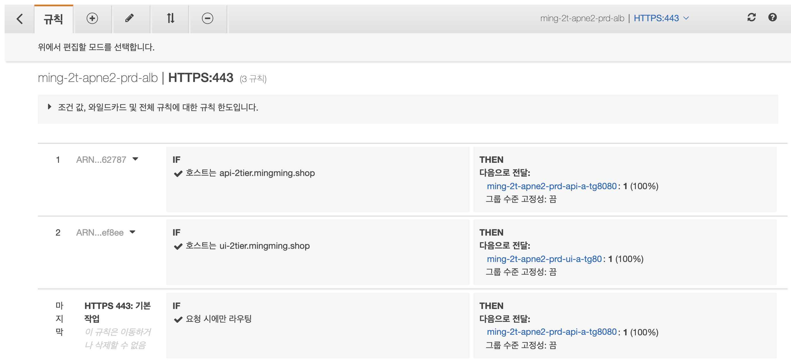
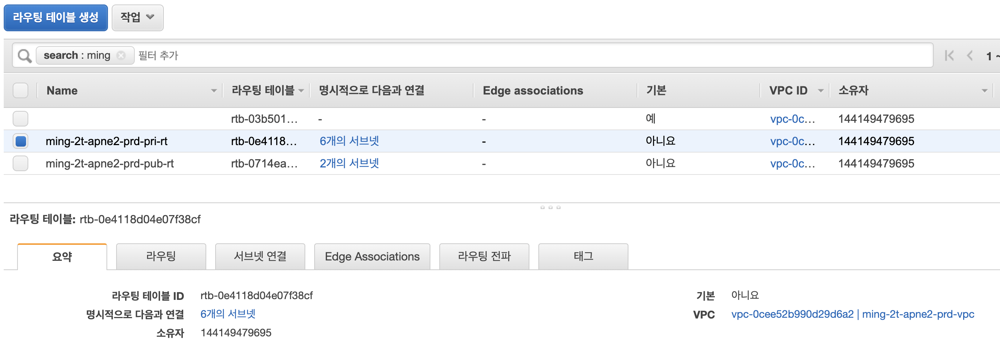

## infra-2tier-services Modules
---
modules는 `elb`, `vpc`로 구성되어 있습니다.

---
#### 1. ELB
infra-2tier-base에서 기구축한 **Application Load Balancer(ming-2t-apne2-prd-alb)** 를 참조하여, listener와 listener rule을 추가합니다.
```console
resource "aws_alb_listener" "alb-listener443" {        -- ALB listener 설정
    load_balancer_arn   = var.alb_id                    -- 기구축된 ALB 참조
    port                = 443                           -- 포트
    protocol            = "HTTPS"                       -- 프로토콜
    certificate_arn     = var.acm_arn                   -- HTTPS 사용시 설정
    ...
}

resource "aws_alb_listener_rule" "alb-listener443-rule" {   -- ALB listener rule 설정
    listener_arn = aws_alb_listener.alb-listener443.arn     -- rule을 attach할 listener

    action {
        target_group_arn    = var.api-a-tg8080.arn          -- ALB와 연결될 target group
    }

    condition {
        host_header {
            value = [ var.hosts.api ]                       -- header 설정
        }
    }
    ...
}
```

해당 ALB에 `api listener rule`과 `ui listener rule`이 추가된 모습입니다.   

>
>
#### 2. VPC
infra-2tier-base에서 기구축한 **VPC(ming-2t-apne2-prd-vpc)** 를 참조하여, subnet과 route table을 생성합니다.
```console
resource "aws_subnet" "pri-sn" {                    
    vpc_id              = var.vpc_id
    count               = length(var.pri_sn_list)
    cidr_block          = lookup(var.pri_sn_list[count.index], "cidr_block")
    availability_zone   = lookup(var.pri_sn_list[count.index], "availability_zone")
    depends_on          = [ aws_route_table.pri-rt ]
    ...
}

resource "aws_route_table" "pri-rt" {
    vpc_id      = var.vpc_id
    count       = length(var.private_rt_tag_names)
    depends_on  = [ var.igw_id, var.nat_id ]
    
    route {
        cidr_block      = "0.0.0.0/0"
        nat_gateway_id  = var.nat_id
    }
    ...
}
```
해당 VPC를 참조하면서 `private subnet`, `api subnet`, `ui subnet`, `private route-table` 등이 생성된 모습입니다.  
